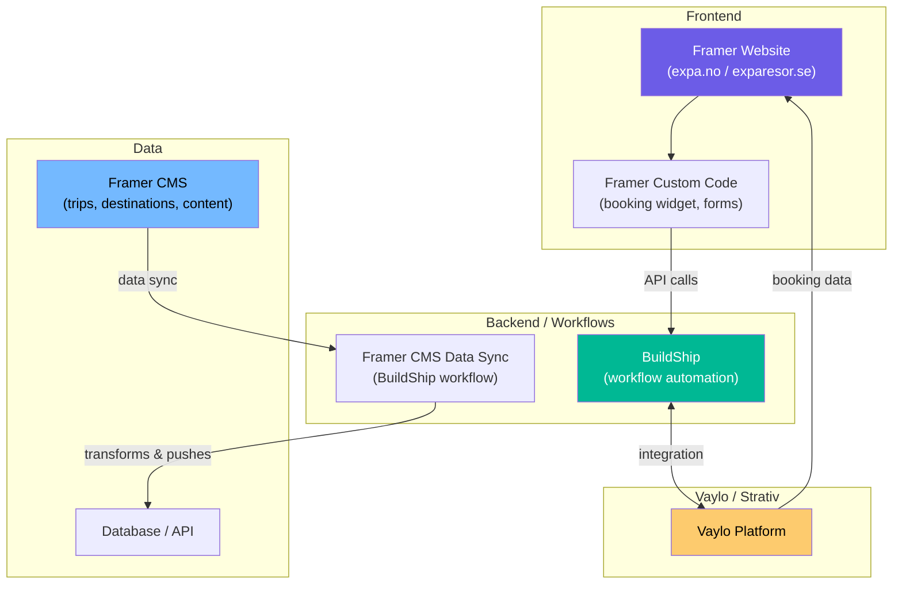
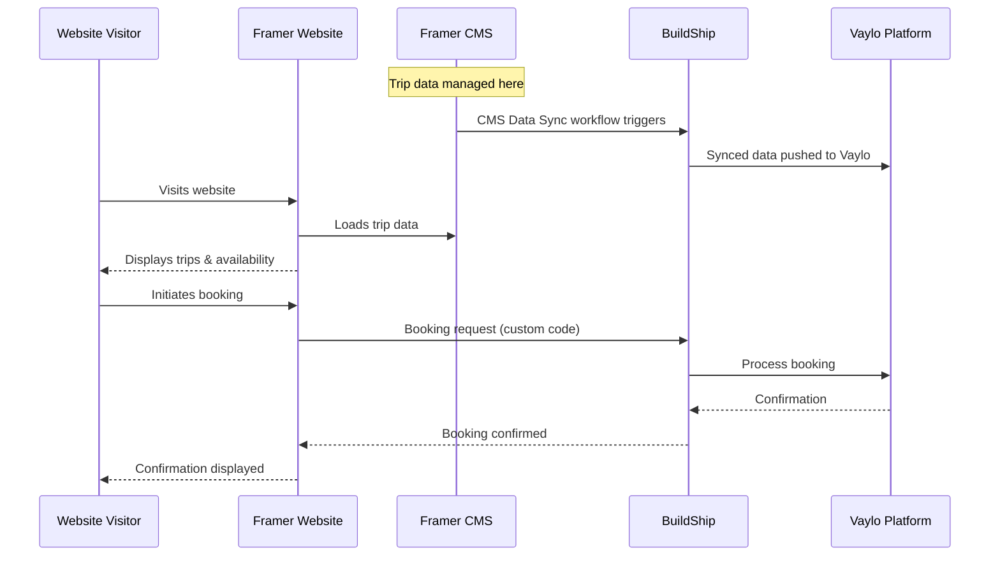

# Architecture Overview

## System Diagram

## How the Pieces Fit Together

### Framer → Website & CMS

Framer serves as both the **website builder** and **content management system** for Expa Travel.

- The public-facing website is built in Framer
- Trip data, destinations, and content are managed in Framer CMS
- Custom code components handle interactive elements (booking widget, forms)

<!-- TODO: Confirm if there are separate Framer projects for expa.no vs exparesor.se, or one project -->

### BuildShip → Backend Workflows

BuildShip handles serverless backend logic:

- **Framer CMS Data Sync** - Syncs CMS data between Framer and external systems
  - Known issue: type mismatch on `capacity` field (expects number, gets string) — see [open-issues.md](./open-issues.md)
- <!-- TODO: List other BuildShip workflows -->

### Vaylo → Booking Platform

<!-- TODO: Describe the Vaylo/Strativ platform relationship -->
<!-- Questions to answer:
  - What does Vaylo provide? (booking engine? trip management?)
  - How does data flow between Framer and Vaylo?
  - Are there APIs? Webhooks? Direct DB connections?
  - What does Erik's team at Vaylo already own vs. what they're inheriting?
-->

## Data Flow

<!-- TODO: Verify this flow is accurate. Adjust arrows and participants as needed. -->

## Environments

| Environment | URL | Notes |
|---|---|---|
| Production (NO) | <!-- TODO --> | Live site |
| Production (SE) | exparesor.se | Live site |
| Staging | <!-- TODO: does one exist? --> | |
| BuildShip | <!-- TODO: BuildShip project URL --> | Backend workflows |
| Framer | <!-- TODO: Framer project URL --> | Website editor |

## Tech Stack Summary

| Layer | Technology | Purpose |
|---|---|---|
| Website | Framer | Website builder + CMS |
| Custom code | JavaScript (Framer) | Interactive components, booking widget |
| Backend | BuildShip | Serverless workflows, data sync |
| Booking platform | Vaylo | <!-- TODO: describe --> |
| <!-- TODO --> | <!-- TODO --> | Any other services? |
