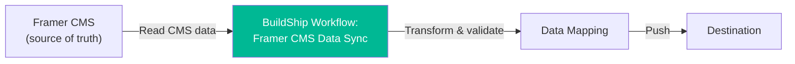

# BuildShip - Backend Workflows

## Overview

BuildShip is used for serverless backend workflows that connect Framer, the CMS, and external services (Vaylo).

<!-- TODO: Add BuildShip project URL -->
<!-- TODO: Add BuildShip account owner / login info reference -->

## Workflows

### 1. Framer CMS Data Sync

**Purpose:** Syncs trip data from the Framer CMS to external systems.

**Trigger:** <!-- TODO: What triggers this? Manual? Scheduled? Webhook on CMS update? -->

**Flow:**

**Known Issue:** The workflow currently errors with:
> `Expected a number value for field: capacity`

This happens when the CMS `capacity` field contains a string value (e.g. `"20"`) instead of a number (`20`). See [open-issues.md](./open-issues.md#cms-data-sync-capacity-type-error) for details and fix.

**Nodes in this workflow:**
<!-- TODO: List the BuildShip nodes/steps in this workflow -->

1. <!-- TODO: First node - e.g., "Fetch CMS data from Framer API" -->
2. <!-- TODO: Data transformation step -->
3. <!-- TODO: Push to destination -->

### 2. <!-- TODO: Other workflows -->

<!-- TODO: Document any other BuildShip workflows -->

## How to Access & Edit

1. Go to [buildship.com](https://buildship.com) and log in (see [access.md](./access.md))
2. Select the Expa project
3. Workflows are listed in the left panel
4. Click a workflow to view/edit nodes
5. Use the "Ship" button to deploy changes

## Environment Variables / Secrets

<!-- TODO: List any API keys, secrets, or environment variables configured in BuildShip -->
<!-- DO NOT paste actual secrets here — just list the names and what they're for -->

| Variable | Purpose | Where to get it |
|---|---|---|
| <!-- TODO: e.g. FRAMER_API_KEY --> | <!-- TODO --> | <!-- TODO --> |
| <!-- TODO --> | <!-- TODO --> | <!-- TODO --> |

## Debugging

- BuildShip has built-in logging — check the execution logs for each workflow run
- The most common error is type mismatches between CMS data and expected field types
- If a workflow fails, check the error details in the execution panel (screenshot shows error inline on the failing node)
