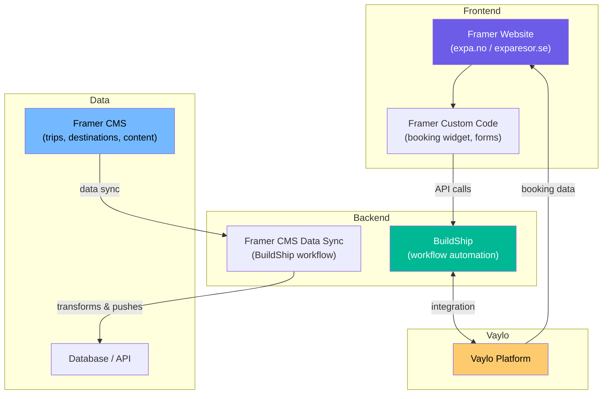
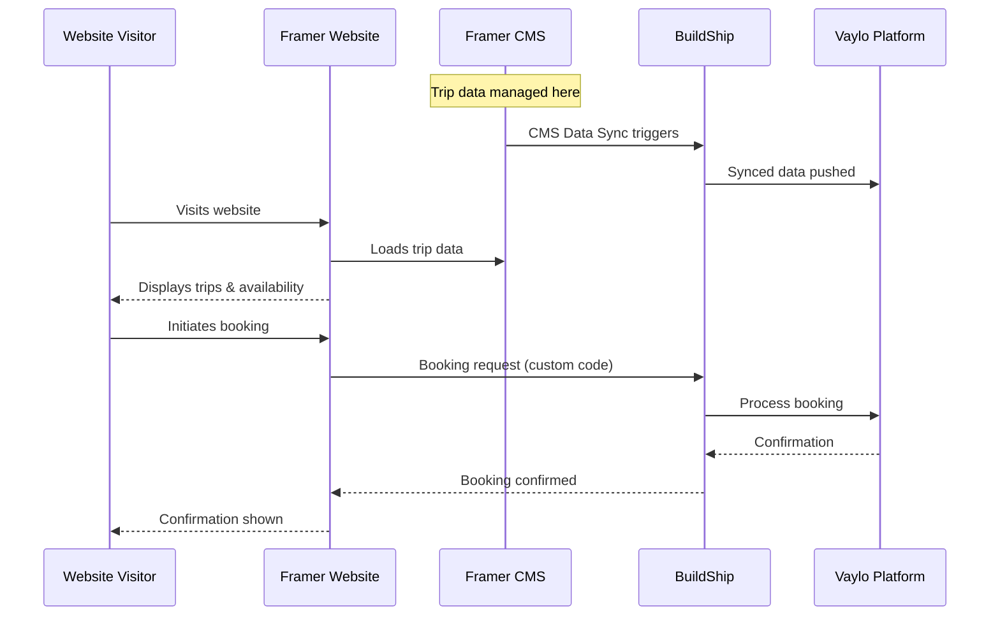

# Architecture

## System Overview

<!-- TODO: Verify this diagram matches reality and adjust -->

## How the Pieces Fit Together

### Framer — Website & CMS

Framer is both the **website builder** and **content management system**.

- Public-facing website built in Framer
- Trip data, destinations, and content managed in Framer CMS
- Custom code components handle interactive elements (booking widget, forms)

<!-- TODO: Are expa.no and exparesor.se separate Framer projects or one? -->

### BuildShip — Backend Workflows

BuildShip handles serverless backend logic:

- **Framer CMS Data Sync** — syncs CMS data to external systems
- <!-- TODO: List other workflows -->

### Vaylo — Booking Platform

<!-- TODO: Describe what Vaylo provides and how it integrates
  - Booking engine? Trip management?
  - APIs? Webhooks? Direct DB?
  - What did Vaylo already own vs. what's being inherited?
-->

## Data Flow

<!-- TODO: Verify this flow is accurate -->

## Environments

| Environment | URL | Notes |
|---|---|---|
| Production (NO) | <!-- TODO --> | |
| Production (SE) | exparesor.se | |
| Staging | <!-- TODO: does one exist? --> | |
| BuildShip | <!-- TODO: project URL --> | |
| Framer | <!-- TODO: project URL --> | |

## Tech Stack

| Layer | Technology | Purpose |
|---|---|---|
| Website | Framer | Website builder + CMS |
| Custom code | JavaScript (Framer) | Booking widget, interactive components |
| Backend | BuildShip | Serverless workflows, data sync |
| Booking platform | Vaylo | <!-- TODO --> |
| <!-- TODO --> | <!-- TODO --> | Other services? |
