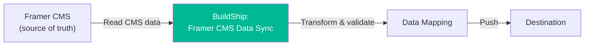

# BuildShip — Backend Workflows

## Overview

BuildShip handles serverless backend workflows connecting Framer, the CMS, and Vaylo.

<!-- TODO: Add BuildShip project URL -->

## Workflows

### 1. Framer CMS Data Sync

**Purpose:** Syncs trip data from Framer CMS to external systems.

**Trigger:** <!-- TODO: manual? scheduled? webhook? -->

**Known issue:** Errors with `Expected a number value for field: capacity` when CMS data contains strings instead of numbers. See [open-issues.md](./open-issues.md#cms-data-sync-capacity-type-error).

**Workflow nodes:**

1. <!-- TODO: e.g. "Fetch CMS data from Framer API" -->
2. <!-- TODO: transformation step -->
3. <!-- TODO: push to destination -->

### 2. <!-- TODO: Other workflows -->

## How to Access

1. Log into [buildship.com](https://buildship.com) (see [access.md](./access.md))
2. Select the Expa project
3. Workflows listed in left panel
4. Click to view/edit nodes
5. "Ship" to deploy changes

## Environment Variables

> Do **not** store secrets here. Just document what variables exist and what they're for.

| Variable | Purpose | Where to get it |
|---|---|---|
| <!-- TODO --> | <!-- TODO --> | <!-- TODO --> |

## Debugging

- Check execution logs in BuildShip for each workflow run
- Most common error: type mismatches between CMS data and expected field types
- Error details shown inline on the failing node in the workflow editor
